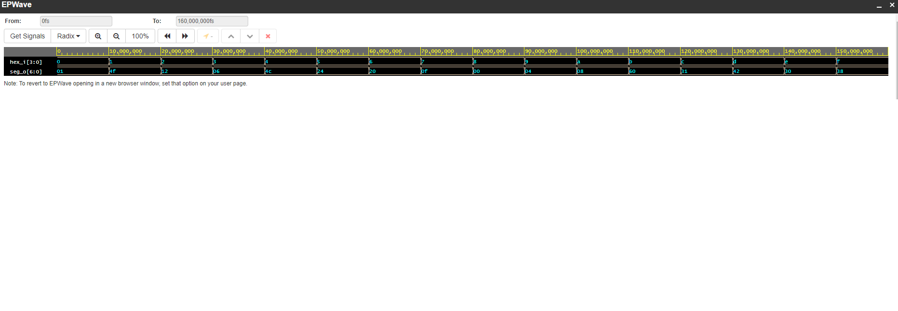

# Lab 4: Michal Český

### Seven-segment display decoder

1. Listing of VHDL stimulus process from testbench file (`tb_hex_7seg.vhd`) with asserts. Verify all input combinations. Always use syntax highlighting, meaningful comments, and follow VHDL guidelines:

```vhdl
    p_stimulus : process
    begin
        report "Stimulus process started" severity note;

        -- First test case
        s_hex <= "0000"; wait for 50 ns;
        assert (s_seg = "0000001")
        report "Input combination 0000 FAILED" severity error;

        report "Testing 1 ..." severity note;		 -- TEST 1
        s_hex_i <= "0001";
        wait for 10 ns;
        assert (s_seg_o = "1001111")
        report "Test failed for input combination: 1" severity error; 
                
        report "Testing 2 ..." severity note;		 -- TEST 2
        s_hex_i <= "0010";
        wait for 10 ns;
        assert (s_seg_o = "0010010")
        report "Test failed for input combination: 2" severity error; 
        
        report "Testing 3 ..." severity note;		 -- TEST 3
        s_hex_i <= "0011";
        wait for 10 ns;
        assert (s_seg_o = "0000110")
        report "Test failed for input combination: 3" severity error; 
        
        report "Testing 4 ..." severity note;		 -- TEST 4
        s_hex_i <= "0100";
        wait for 10 ns;
        assert (s_seg_o = "1001100")
        report "Test failed for input combination: 4" severity error; 
        
        report "Testing 5 ..." severity note;        -- TEST 5
        s_hex_i <= "0101";
        wait for 10 ns;
        assert (s_seg_o = "0100100")
        report "Test failed for input combination: 5" severity error; 
        
        report "Testing 6 ..." severity note;        -- TEST 6
        s_hex_i <= "0110";
        wait for 10 ns;
        assert (s_seg_o = "0100000")
        report "Test failed for input combination: 6" severity error; 
        
        report "Testing 7 ..." severity note;        -- TEST 7
        s_hex_i <= "0111";
        wait for 10 ns;
        assert (s_seg_o = "0001111")
        report "Test failed for input combination: 7" severity error; 
        
        report "Testing 8 ..." severity note;        -- TEST 8
        s_hex_i <= "1000";
        wait for 10 ns;
        assert (s_seg_o = "0000000")
        report "Test failed for input combination: 8" severity error; 
        
        report "Testing 9 ..." severity note;        -- TEST 9
        s_hex_i <= "1001";
        wait for 10 ns;
        assert (s_seg_o = "0000100")
        report "Test failed for input combination: 9" severity error; 
        
        report "Testing 10 ..." severity note;      -- TEST 10(A)
        s_hex_i <= "1010";
        wait for 10 ns;
        assert (s_seg_o = "0001000")
        report "Test failed for input combination: 10" severity error; 
        
        report "Testing 11 ..." severity note;        -- TEST 11 (B)
        s_hex_i <= "1011";
        wait for 10 ns;
        assert (s_seg_o = "1100000")
        report "Test failed for input combination: 11" severity error; 
        
        report "Testing 12 ..." severity note;        -- TEST 12 (C)
        s_hex_i <= "1100";
        wait for 10 ns;
        assert (s_seg_o = "0110001")
        report "Test failed for input combination: 12" severity error; 
        
        report "Testing 13 ..." severity note;        -- TEST 13 (D)
        s_hex_i <= "1101";
        wait for 10 ns;
        assert (s_seg_o = "1000010")
        report "Test failed for input combination: 13" severity error; 
        
        report "Testing 14 ..." severity note;        -- TEST 14 (E)
        s_hex_i <= "1110";
        wait for 10 ns;
        assert (s_seg_o = "0110000")
        report "Test failed for input combination: 14" severity error;
        
        report "Testing 15 ..." severity note;        -- TEST 15 (F)
        s_hex_i <= "1111";
        wait for 10 ns;
        assert (s_seg_o = "0111000")
        report "Test failed for input combination: 15" severity error; 

        report "Stimulus process finished" severity note;
        wait;
    end process p_stimulus;
```

2. Screenshot with simulated time waveforms. Always display all inputs and outputs (display the inputs at the top of the image, the outputs below them) at the appropriate time scale!

   

### LED(7:4) indicators

1. Listing of LEDs(7:4) part of VHDL architecture from source file `top.vhd`. Try to write logic functions as simple as possible. Always use syntax highlighting, meaningful comments, and follow VHDL guidelines:

   ```vhdl
   -- Experiments on your own: LED(7:4) indicators

   -- Turn LED(4) on if input value is equal to 0, ie "0000"
   -- LED(4) <= '1' when (SW = "0000") else '0';

   -- Turn LED(5) on if input value is greater than "1001", ie 10, 11, 12, ...
   -- LED(5) <= '1' when (unsigned(SW) > 9) else '0';
   
   -- Turn LED(6) on if input value is odd, ie 1, 3, 5, ...
   -- LED(6) <= '1' when (unsigned(SW) mod 2 = 1) else '0';

   -- Turn LED(7) on if input value is a power of two, ie 1, 2, 4, or 8
   -- LED(7) <= '1' when (SW = "0001" or SW = "0010" or SW = "0100" or SW = "1000") else '0';
   ```
